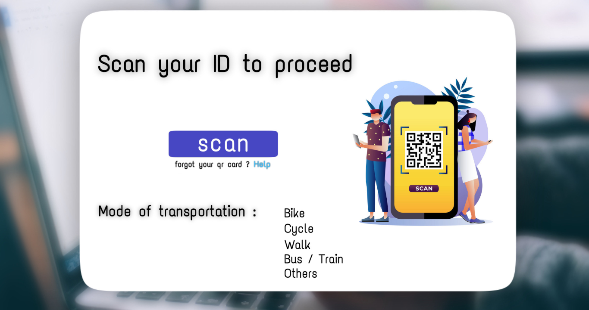

# Attendance Manager 📋

A desktop-based attendance management system developed using Python, Tkinter, and MySQL with QR code scanning support for students and staff attendance tracking.

## Features
- Student & staff attendance management
- QR code-based attendance scanning
- MySQL database integration
- Simple Tkinter GUI
- Attendance record storage and management

## Screenshots

### Login


### Selection


### QR Attendance Scanner


## Tech Stack
- Python
- Tkinter
- MySQL
- OpenCV / QR Scanner

## Setup
1. Clone the repository
2. Install required Python packages
3. Configure MySQL database
4. Run the application

```bash
python main.py
```

## Project
This project was created to simplify attendance tracking for educational institutions and staff management systems.
